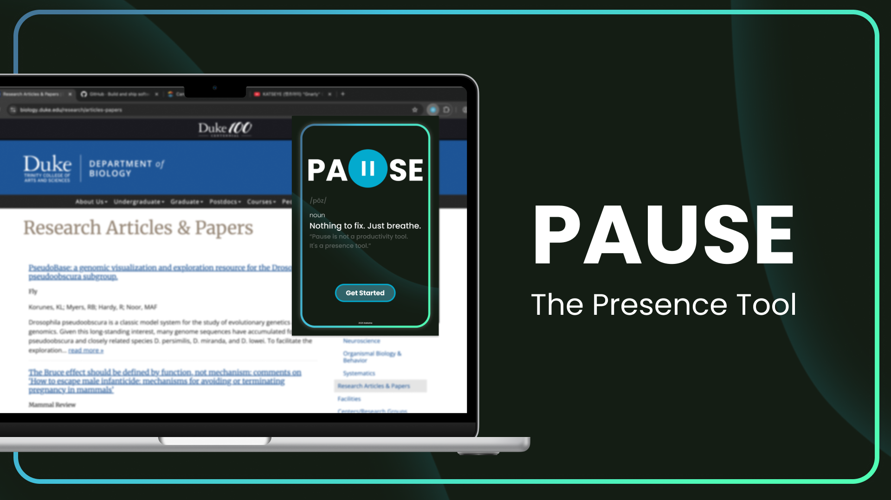

# [Pause](https://devpost.com/software/pause-03gtv6)
> ### Not a productivity tool. It's a presence tool.

  
  
  
  
  

 

## Inspiration
In our always-on digital world, everyone—from students juggling tabs to professionals toggling between apps—feels the strain of nonstop screen time. We asked peers what they wished they had at the peak of their digital fatigue, and the answer was universal: a gentle reminder to simply breathe. By reclaiming those missing moments between notifications, **Pause** aims to transform tiny breaks into mindful resets.

## What It Does
**Pause** is a cross-platform app and browser extension that delivers visual or audio cues reminding you to take a breath and reset your focus. There’s no tracking, no gamification, no pressure: just calming animations, brief quotes, or ambient sounds that fade in and out to ground you in the present.

## How We Built
- **Frontend:**  React, Tailwind CSS for a clean, responsive UI. We used TypeScript to ensure type safety and a better developer experience, especially when working with Chrome Extension APIs and managing message-passing logic between the background, content, and popup scripts. TypeScript helped prevent runtime errors by catching type mismatches early, particularly when defining and handling structured messages (e.g., "startScan" actions).
- **Backend & API:** Leveraged Chrome Extension APIs and background scripts as our backend, managing cross-component logic, tab updates, and persistent state without relying on a traditional server.
- **Prototype:** Crafted in Figma to nail down timing algorithms and micro-interactions before writing a single line of code.

## Challenges We Ran Into
- **Optimal Timing**: Finding the perfect interval for micro-pauses so they feel supportive rather than disruptive.
- **Consistent Multi-Modal Experience**: Crafting visual, audio, and silent reminder modes that all convey the same sense of calm.
- **Pure Simplicity**: Distilling every design element to its emotional essence—whether it’s a single quote card or a soft gradient.
- **Lean Extension Architecture**: Integrating React, TypeScript, and Tailwind into a Chrome Extension scaffold without bloating our bundle.

## Accomplishments That We're Proud Of
- Resolved tricky dependency issues while integrating React, TypeScript, and Tailwind in a Chrome Extension environment.
- Successfully set up a fully functional Chrome Extension from scratch, including manifest configuration, background scripts, and content scripts.
- Enabled seamless interaction between components and scripts, allowing popup UIs, content scripts, and background functions to communicate effectively.

## What We Learned
- Learned how to set up and develop a complete Chrome Extension, including manifest configuration, content scripts, and background scripts.
- Gained experience with message passing and script communication within the extension to coordinate functionality across components.
- Expanded beyond typical extension behavior by modifying the user's active tab to create immersive break reminders with visual and functional changes.
- Improved our understanding of working with the DOM through scripts while maintaining a smooth user experience.
- Explored Gemini API integration to generate personalized encouragement and mindful prompts.
Strengthened our ability to troubleshoot, iterate, and adapt quickly in a cross-platform development environment.

## What's Next for Pause
- **Mood detection**: Use webcam-based stress cues to adapt pause frequency.
- **Environment sync**: Auto-switch themes based on time of day or season.
- **Collaborative pauses**: Friends can share micro-breaks in real time—because presence is more powerful together.